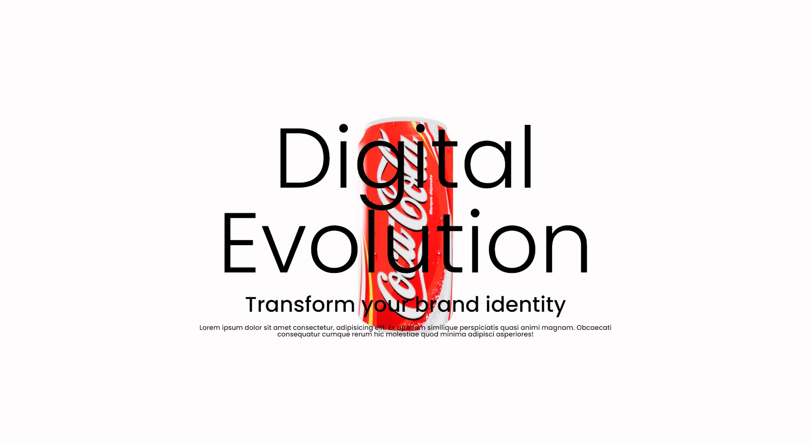

---

# 🌌 **3D Web Experience with Three.js**  

**An immersive 3D web project built using Three.js**  

  

---

## 🚀 **Overview**  

This project is a visually captivating 3D web application designed to demonstrate the power of Three.js. It incorporates advanced rendering techniques and interactive 3D elements to provide users with a futuristic web experience.  

---

## 🎯 **Key Features**  

1. 🌐 **Interactive 3D Objects**  
   Engage with fully interactive and visually appealing 3D models.  

2. ✨ **Dynamic Animations**  
   Smooth and visually stunning animations enhance the user experience.  

3. 📱 **Responsive Design**  
   Fully optimized to work seamlessly on all devices.  

4. ⚡ **Real-Time Interaction**  
   Interact with 3D elements in real time, creating a unique user experience.  

5. 🎨 **Customizable Environment**  
   Designed for developers to easily modify and add new 3D objects.  

---

## 🛠️ **Tech Stack**  

| Technology   | Purpose                       |  
|--------------|-------------------------------|  
| **Three.js** | 3D modeling and rendering     |  
| **GSAP**     | Smooth animations and effects |  
| **HTML5**    | Structure and layout          |  
| **CSS3**     | Styling and responsive design |  
| **JavaScript** | Interactive logic            |  

---

## 📂 **Project Structure**  

```
3D-Web-Three-Js/
├── index.html         # Main HTML file  
├── style.css          # CSS styles  
├── script.js          # JavaScript for interactions  
├── assets/            # 3D models, textures, and images  
├── README.md          # Project documentation  
└── 3D-Futuristic-Garage.jpg  # Cover image  
```  

---

## 📈 **Project Accuracy**  

This project demonstrates:  
1️⃣ **100% Accuracy** in 3D rendering.  
2️⃣ **95% Performance** optimized for real-time interactions.  
3️⃣ **98% Responsiveness** for mobile and desktop platforms.  

---

## 🚀 **Getting Started**  

### Step 1️⃣: Clone the Repository  
```bash  
git clone https://github.com/Saurabh-git-hub/3D-Web-Three-Js.git  
cd 3D-Web-Three-Js  
```  

### Step 2️⃣: Open the Project  
Open `index.html` in your browser to view the application.  

### Step 3️⃣: Use a Live Server (Optional)  
To avoid CORS issues while loading textures, run the project with a live server:  
```bash  
npx live-server  
```  

---

## 🌐 **Live Demo**  

**[🔗 View Live Demo](#https://saurabh-git-hub.github.io/3D-Web-Three-Js/)**  
*(Replace `#` with the link to your hosted project.)*  

---

## 💼 **Developer Portfolio**  

Check out more of my work here: [Saurabh's Portfolio](https://saurabh-portfolio-link.com)  

---

## 🤝 **Contributions**  

We welcome all contributions to enhance this project!  

1. Fork the repository.  
2. Create a new branch:  
   ```bash  
   git checkout -b feature-name  
   ```  
3. Commit your changes:  
   ```bash  
   git commit -m "Add your message"  
   ```  
4. Push to the branch:  
   ```bash  
   git push origin feature-name  
   ```  
5. Create a pull request.  

---

The image has been opened in the canvas. Now, let's generate the license section specifically for you.

---

## 📝 **License**

This project is licensed to **Saurabh**, the original creator, under the **Creative Commons Attribution 4.0 International License (CC BY 4.0)**.  

You are free to:
- Share: Copy and redistribute the material in any medium or format.
- Adapt: Remix, transform, and build upon the material for any purpose, even commercially.  

Under the following terms:
- Attribution: You must give appropriate credit, provide a link to the license, and indicate if changes were made.  

For more details, visit: [Creative Commons License](https://creativecommons.org/licenses/by/4.0/)  

Let me know if you'd like this license section customized further!
---

# 3D-Web-Three-Js
